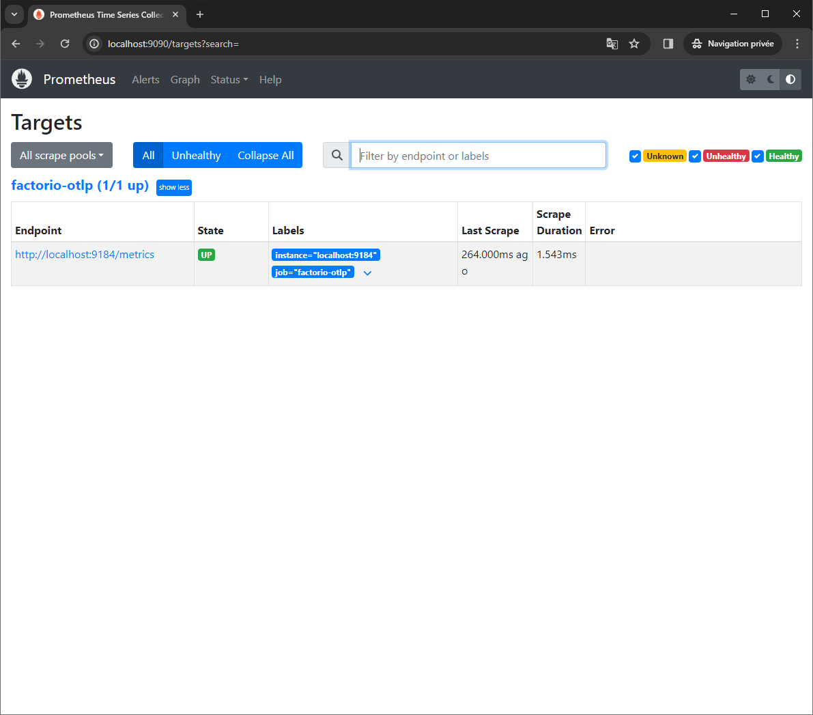
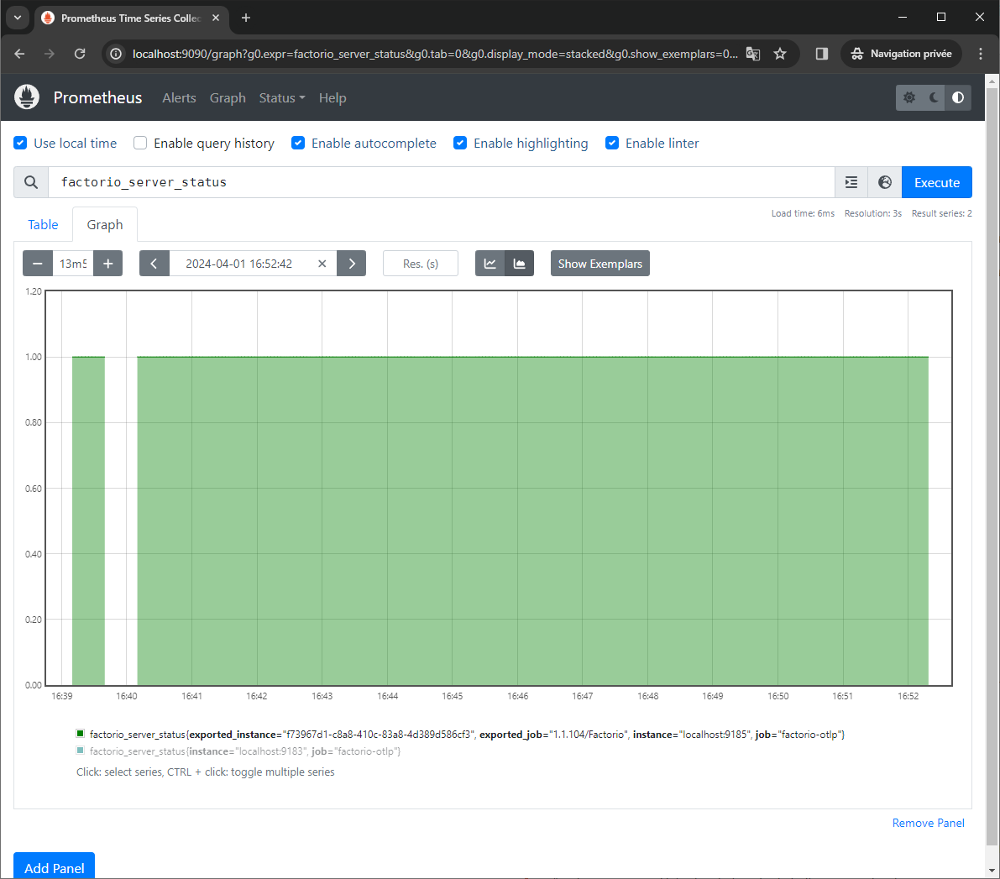
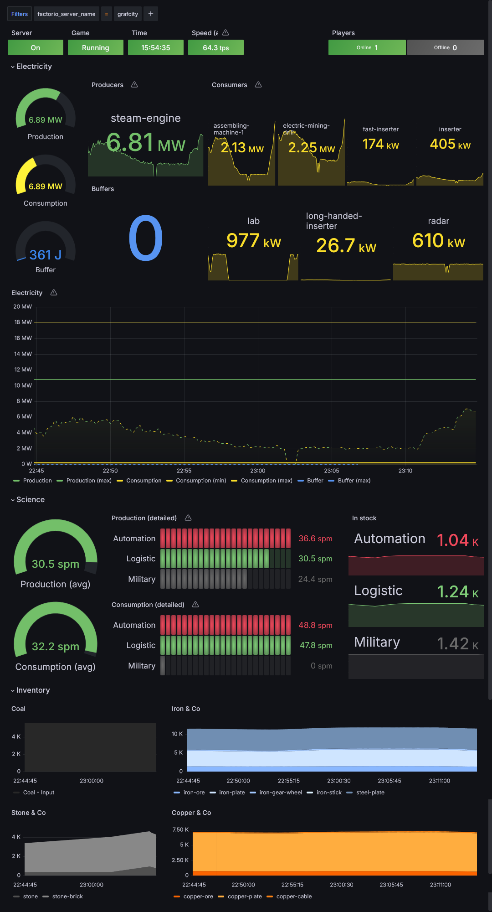

# FactorioSharp.Instrumentation

Collect data from a Factorio server through an RCON connection and define emit them as metrics.

In order to keep the number of requests per second manageable, the collection of data from the server is rate-limited: in addition to specifying refresh rates on the different quantities that are measured, there is a master rate-limit that restricts the number of requests per second performed on the server.  
The orchestration is performed by a background service that must be added to the host application.

Note: Emitting traces for the commands that are executed on the RCON is a **WIP**.

## Getting started

The RCON interface must be enabled when running factorio. It must also be secured using a password.
Add the following parameters to the factorio launch command: `--rcon-port 27015 --rcon-password factory`

For example
```
bin\x64\factorio.exe --start-server saves/save.zip --rcon-port 27015 --rcon-password password
```

You should see a log message in the factorio console that looks like:

```
Info RemoteCommandProcessor.cpp:133: Starting RCON interface at IP ADDR:({0.0.0.0:27015})
```

The instrumentation can then be configured using the provided extension methods

### Using the console exporter

The program above should write all the metrics to the console. There are way too many metrics for it to be readable, but making this work ensures that the connection between factorio and the application works as expected.

```c#
using FactorioSharp.Instrumentation.Meters;
using Microsoft.Extensions.DependencyInjection;
using Microsoft.Extensions.Hosting;
using Microsoft.Extensions.Logging;
using OpenTelemetry.Metrics;
using OpenTelemetry.Resources;

const string serviceName = "Factorio";
const string serviceVersion = "1.1.104";

HostApplicationBuilder builder = Host.CreateApplicationBuilder(args);

builder.Services.AddOpenTelemetry()
    .WithMetrics(
        metrics => metrics.ConfigureResource(resource => resource.AddService(serviceName, serviceVersion))
            .AddFactorioInstrumentation(
                options =>
                {
                    options.Server.Uri = new Uri("http://localhost:27015");
                    options.Server.RconPassword = "password";
                }
            )
            .AddConsoleExporter()
    );

IHost app = builder.Build();

app.Run();
```

### Using the Prometheus listener

This library uses the standard System.Diagnostics tools to expose the collected data and it registers them with the OpenTelemetry SDK. It can be used with any OpenTelemetry exporter including the Prometheus one.

See also [this documentation](https://learn.microsoft.com/en-us/dotnet/core/diagnostics/metrics-collection) from Microsoft about metrics collection using Prometheus and Grafana.

#### Expose the metrics using the Prometheus HTTP listener

Install the `OpenTelemetry.Exporter.Prometheus.HttpListener` nuget which provides the `AddPrometheusHttpListener` extension method, then use it to expose the collected metrics on `http://localhost:9184`.

```c#
using FactorioSharp.Instrumentation.Meters;
using Microsoft.Extensions.DependencyInjection;
using Microsoft.Extensions.Hosting;
using Microsoft.Extensions.Logging;
using OpenTelemetry.Metrics;
using OpenTelemetry.Resources;

const string serviceName = "Factorio";
const string serviceVersion = "1.1.104";

HostApplicationBuilder builder = Host.CreateApplicationBuilder(args);

builder.Services.AddOpenTelemetry()
    .WithMetrics(
        metrics => metrics.ConfigureResource(resource => resource.AddService(serviceName, serviceVersion))
            .AddFactorioInstrumentation(
                options =>
                {
                    options.Server.Uri = new Uri("http://localhost:27015");
                    options.Server.RconPassword = "password";
                }
            )
            .AddPrometheusHttpListener(options => options.UriPrefixes = ["http://localhost:9184/"])
    );

IHost app = builder.Build();

app.Run();
```

#### Prometheus

- [Install prometheus](https://prometheus.io/docs/introduction/first_steps/).
- Setup the collector to read from the endpoint at `localhost:9184`. See below for a minimal `config.yml`.

```yml
global:
  scrape_interval: 15s
  evaluation_interval: 15s

scrape_configs:
  - job_name: 'factorio-otlp'
    scrape_interval: 1s
    static_configs:
      - targets: ['localhost:9184']
```



Display the `factorio_server_status` signal to make sure that it works as expected



The timeseries exposed by prometheus can then be used to build dashboards.

Example of Grafana dashboard in an early game:

